# Torrent To Google Drive (UI Added!😊)

<b>A Simple and User-Friendly Google Collab Notebook with UI to download Torrent to Google Drive using (.Torrent) File or by Magnet Link.</b>

<h4><b>⛔NOTICE: This Repository is now merged with Multi Cloud Transfer Tool to make it more effective and powerful! Please continue with new Repository. It just here for backend comfortability.</b></h4>
<h4><b>New Repository: https://github.com/TheCaduceus/Multi-Cloud-Transfer-Tool</b></h4>

<h2>🆕What's New?🆕</h2>
<h4>1.Direct Google Account Login!🤩</h4>
<h4>2.Added Timeout Preventer Advanced!😊</h4>
<h4>3.Added PATH Generator for Shared Drive!😁</h4>
<h4>4.Integreated Speed Tester!😎</h4>
<h4>5.Added Shared Drives Support!😉</h4>

<h2>⚙️ How to Use ?</h2>
<h4> 1.First Open the Code in Google Collab!  </h4>
<h4> 2.It is too Simple! Download the Setup file and Environment Config files from the code as shown in the Image.</h4>

<h4> 3.Now run the Timeout preventer to prevent Google Colab from getting Time out!</h4>

<h4> 4.After that! Connect your Google account, for that choose "Mount" from the Drop down list as shown in the Image.</h4>

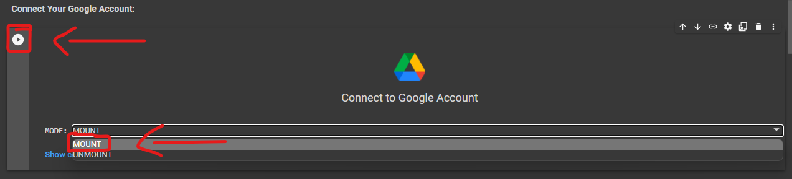

<h4> 5.If you want then you can check that from which speed Google is going to download your Torrent Data as shown in the Image.&lt;/a&gt;</h4>

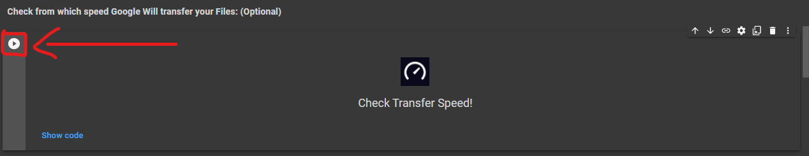

<h3>🗂️Download Torrent to My Drive</h3>

For Shared Drive:<a href="https://github.com/TheCaduceus/Torrent-to-GoogleDrive#download-torrent-to-shared-drives"> Read Here</a>

<h4> 6.To download Torrent in My Drive then choose anyone method provided under "Torrent to My Drive" that is Upload (.Torrent) File or by "Magnet Link" as shown in the Image.</h4>

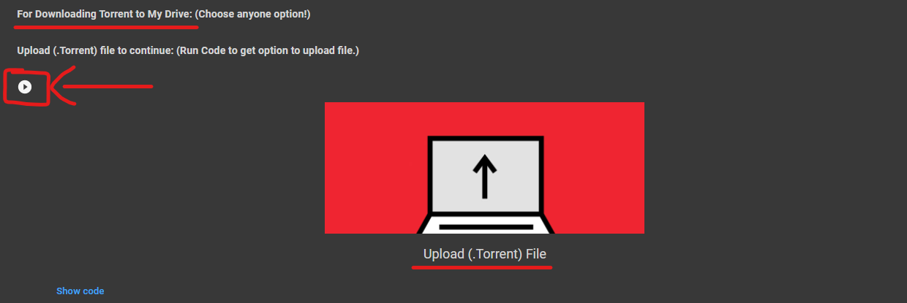
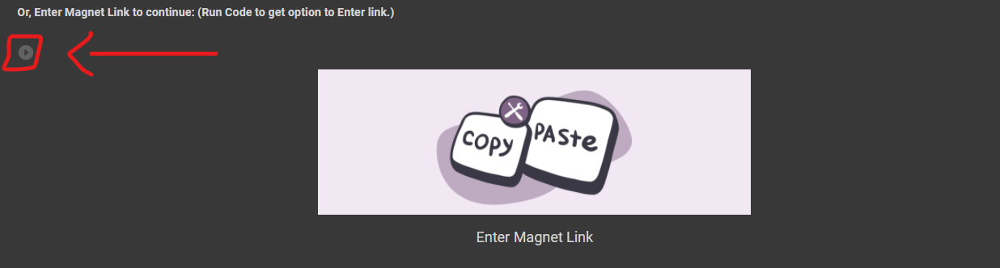

<h4> 7.Now to upload (.Torrent) File or to Enter Magnet Link run that particular code as shown in the given Image below and click ENTER.</h4>

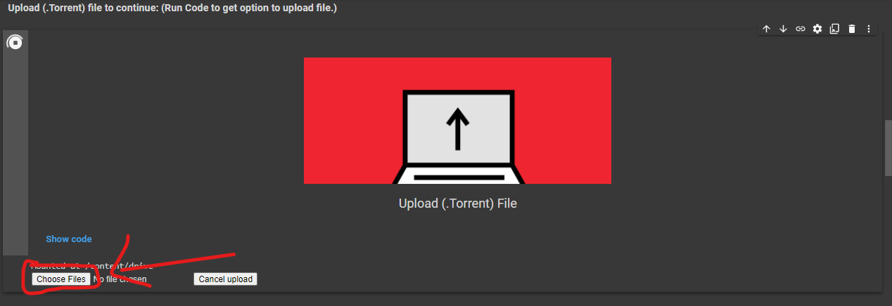
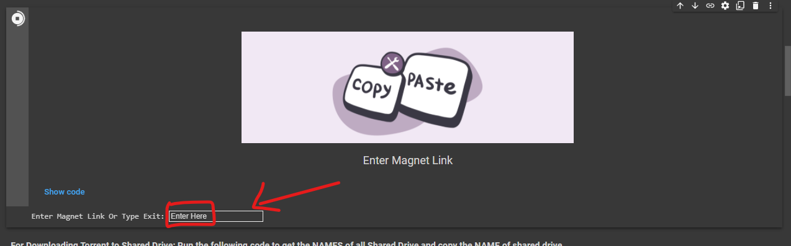

<h4> 8.Finally! Go to the Last section "Start Downlod to Google Drive" and Run the Code.</h4>

<h5> <b><i>❗NOTE: You can Download files of max 342GB at once(By using Google CPU+GPU+TPU) and 750GB/Day because of the restriction set by Google❗</i></b></h5>
<h3>📂Download Torrent to Shared Drives</h3>
<h4> 1.First go to the Section "For Downloading Torrent to Shared Drive" and run the code to see the NAMES of Available Shared Drives in your Google Drive as shown in the Image.</h4>

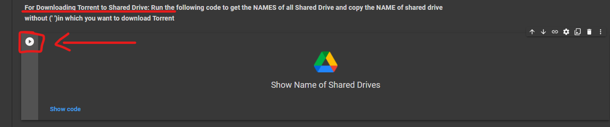

<h4> 2.Now copy the NAME of Shared Drive without (' ') in which you want to Download Torrent.</h4>

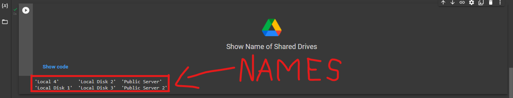

<h4> 3.After that! Paste the name at place of "SHARED DRIVE NAME" and copy the complete path as shown in the Image.</h4>

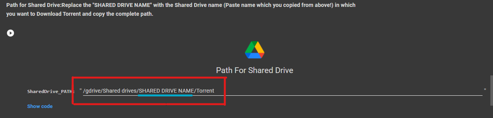

<h4> 4.Then Scroll Down! You will see two method to download Torrent to Google Drive that is through (.Torrent) File or by "Magnet Link" choose anyone method and click "Show Code" button!</h4>

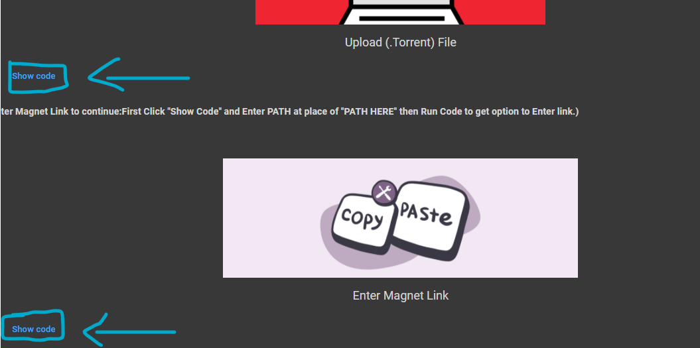

<h4> 5.Now a code is visible to you! Just paste the PATH(which you copied above) at place of "PATH HERE" inside the " " and then Run the Code.</h4>

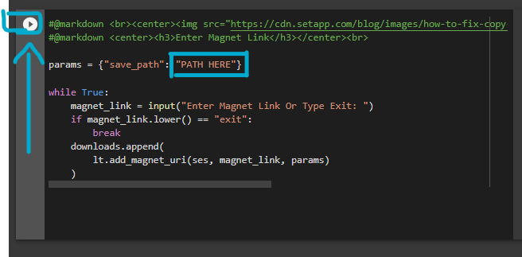

<h4> 6.After doing all this! Follow STEP 7 and STEP 8 (Written Above) to Complete your Work.</h4>
<h2>〽️Variables Used</h2>
<h4>1.SHARED DRIVE NAME: Replace with the Shared Drive name in which file needs to be downloaded.</h4>
<h4>2.PATH: Location or Address of My Drive or Shared Drive to Download Torrent in it.</h4>
<h4>3.SharedDrive_PATH: Path of Shared Drive to download files in it.</h4>
<h4>4.Magnet_LINK: The link which provides source of files from where they had to be downloaded.Here it is an exceptional Variable,since User will provide this.</h4>
<h4>5.Torrent_File: The Record of Sources from where to download files,Here it is an exceptional Variable, since User will provide this.</h4>
<h2>📑Packages Used</h2>
<h4>1.BitTorrent Package</h4>
<h4>2.LitTorrent Package</h4>
<h4>3.Private Environment Config Files</h4>
<h2>🎯Points to be Remembered🎯</h2>
<h4>1.You can upload 10,000 <a href="https://github.com/TheCaduceus/Torrent-to-GoogleDrive#5torrent_file-the-record-of-sources-from-where-to-download-fileshere-it-is-an-exceptional-variable-since-user-will-provide-this">(.torrent) file</a> at a time to download your files to Google Drive.</h4>
<h4>2.You can Enter Unlimited <a href="https://github.com/TheCaduceus/Torrent-to-GoogleDrive/blob/main/README.MD#4magnet_link-the-link-which-provides-source-of-files-from-where-they-had-to-be-downloadedhere-it-is-an-exceptional-variablesince-user-will-provide-this">Magnet Link</a> to download files to your Google Drive.</h4>
<h4>3.You can use Google's CPU+GPU+TPU for getting more space: Just Click on Runtime&gt;&gt;Change Runtime Type&gt;&gt;Choose GPU and then TPU for more space.</h4>
<h4>4.By Default you are connected to Google's CPU for doing anything in Google Collaboratory.</h4>
<h4>5.You can transfer 750GB/Day because of restriction set by Google.</h4>
<h4>6.Once all Storage got filled! and to get it back just close that Tab in which Colab is running and open it in a new Tab.</h4>
<h2> 🔐 Safe or Not? ✅</h2>
<h4> 1.Don't Worry! No data will be shared with anyone, if you use the <a href="https://github.com/TheCaduceus/Torrent-to-GoogleDrive">Original code</a>.🔒</h4>
<h4> 2.This code do not share even a single piece of data to any third party source and not create any log of that!🔑</h4>
<h4> 3.Do not trust any other copy of this Code.📚</h4>
<h2> 🤔 Why Use This?</h2>
<h4>If you use Google Collab for Long term use, then you can understand that it requires Human Interaction atleast one time per 90 Minutes! Otherwise it will cancel the task and all your Work will got failed! But this Repository comes with the code which prevent this. Yes you heard it right just click on the "Play Code Button" of "Timeout Preventer" and then don't worry about time out! Also sometimes it become defficult to upload Files directly to Shared Drives, So we have added a dedicated Shared Drive Section in the UI. We update every Repository on a regular Basis and fix Problems reported to us by our Users!</h4>
<h2> 📥Download</h2>
<h4> You can also Download this GitHub Repository as (.zip) file:</h4>
<h4> <a href="https://github.com/TheCaduceus/Torrent-to-GoogleDrive/archive/refs/heads/main.zip">Download Now</a></h4>
<h2>⛑Contact Us!</h2>
<h4>Join our Update Channel at Telegram:<a href="https://telegram.me/TheCaduceusUPDATE"> Join Now!</a>
<h4>Directly Contact the Developer using Telegram <a href="https://telegram.me/HelpAutomatted_Bot">@HelpAutomatted_Bot</a></h4>
<h2>❤️Credits &amp; Thanks</h2>

<a href="https://github.com/TheCaduceus">Dr.Caduceus</a>: For making UI and Collab Notebook.

</h4>
